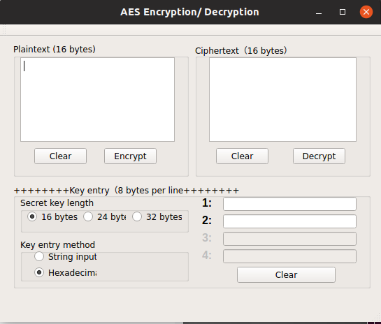
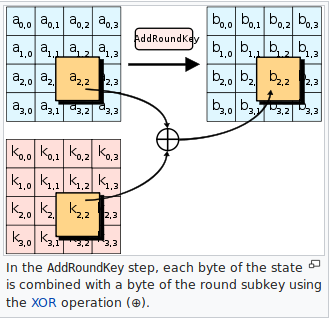

# Cryptography
Advanced Encryption Standard (AES) code implemented in two graphical user interfaces (GUIs): AES-256_GUI and AES-128_GUI

## AES-256_GUI
Written by Walt Kilar in 2010 for Norwich University MSIA project.

### Overview
Simple AES-256 application with QT graphical interface

### Files
* AES-256
* AES-256_GUI.pro
* AES-256.h
* AES-256.pro
* AES_algorithm.cpp
* AES-QT.pro
* AFC.ico
* main.cpp
* mainwindow.cpp
* mainwindow.h
* mainwindow.ui
* Makefile
* myico.rc
* README.md
* StdAfx.h
* Test Vectors.txt

### Installation
* qmake -project
* qmake AES-256_GUI.pro
* make

### Usage
* ./AES-256

### Description
The Advanced Encryption Standard (AES) is described in National Institute of Standards and Technology (NIST) Federal Information Publication Standard (FIPS) 197 and is implemented here as follows:

AES_algorithm.cpp implements the substituion-permutation network as a 4 x 4 column-major array of bytes termed as the state. Calculations are performed in a finite field.

1. KeyExpansion 
* @ param values Round keys are derived from the cipher key using Rijndael's key schedule using a 128-bit round key block for each round plus one more.
* @ return column major array of keys
* @ remark 10 rounds for 128-bit keys, 12 rounds for 192-bit keys, and 14 rounds for 256-bit keys

* AES::AES(unsigned char* key){ unsigned char sBox[] = {...}

2. Initial round key addition - AddRoundKey combines each byte of the state with a block of the round key via bitwise xor.
* @param AddRoundKey combines each byte of the state with a block of the round key via bitwise xor.
* @ return bitwise xor column major array

* unsigned char* AES::Cipher(unsigned char* input)
* unsigned char* AES::InvCipher(unsigned char* input)
* void* AES::Cipher(void* input, int length)
* void AES::KeyExpansion(unsigned char* key, unsigned char w[][4][4])

3. Middle and final round key addition
 * @ param SubBytes - nonlinear substitution of bytes via lookup table
 * @ param ShiftRows - transposition of the last three rows of the state
 * @ param MixColumns - linear mixing of the four bytes in each column
 * @ param AddRoundKey - same as above
 * @ return bitwise xor column major array

